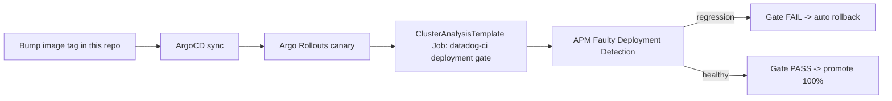

# storedog-infra

Infrastructure-as-Code for running [`datadog-asean-se/storedog`](https://github.com/datadog-asean-se/storedog)
on GKE with **ArgoCD (GitOps)** and **Argo Rollouts**, purpose-built to demo the
**Deploy** phase of the Agent Development Lifecycle (ADLC):

> Commit an image tag → **ArgoCD** syncs → **Argo Rollouts** canary → **Datadog
> Deployment Gate** (APM **Faulty Deployment Detection**) → **FAIL = auto-rollback /
> PASS = promote**, with **Feature Flags** as a post-deploy kill-switch.



> See [`NOTICE.md`](NOTICE.md): this is an internal SE reference implementation, not
> an officially supported Datadog product, and it intentionally ships a "buggy"
> container build for demo purposes.

## Who this is for

Any Datadog SE who wants to **re-run this demo** (or a variant of it) without
rebuilding the infra from scratch. It targets the shared **`datadog-ese-sandbox`**
GCP project (`asia-southeast1`), but every value is a Terraform variable so you can
point it at your own project.

## Repo layout

| Path | Purpose |
|---|---|
| `terraform/` | Ephemeral GKE cluster (Standard, private nodes, DNS control-plane endpoint, no firewall rules). |
| `k8s-manifests/` | storedog app manifests (namespace, Datadog agent, configmaps, secret *examples*, deployments, statefulsets). See its own [README](k8s-manifests/README.md) for the compose→K8s mapping. |
| `rollouts/` | The `discounts` service as an Argo `Rollout` (canary) + the Deployment Gate `ClusterAnalysisTemplate` (JIT `faulty_deployment_detection`) - see [`rollouts/deployment-gates-guide.md`](rollouts/deployment-gates-guide.md). |
| `argocd/` | Two ArgoCD `Application` manifests + install notes. |
| `buggy-image/` | Dockerfile + fault-injection shim for a `discounts:buggy` tag that reliably trips the Deployment Gate. |
| `feature-flags/` | Notes for the staged-rollout / metric-auto-pause demo (third Deploy control). |
| `docs/` | [`datadog-cicd-integrations.md`](docs/datadog-cicd-integrations.md) - Datadog Agent integrations for ArgoCD / Argo Rollouts / Argo Workflows. |
| `scripts/` | `bootstrap.sh` (end-to-end), `port-forward.sh`, `build-and-push-buggy.sh`, `rollout-bad.sh` / `rollout-good.sh` (GitOps trigger/reset). |

## Prerequisites

- Access to the **`datadog-ese-sandbox`** GCP project, with `gcloud` authenticated
  (`gcloud auth login && gcloud config set project datadog-ese-sandbox`).
- CLIs: `terraform` (>=1.6), `gcloud` + `gke-gcloud-auth-plugin`, `kubectl`, `helm`,
  `docker`, `git`. Optional: `kubectl-argo-rollouts` plugin.
- A Datadog org with `DD_API_KEY` / `DD_APP_KEY` you can use for this cluster.
- **Push access to this repo** (or your own fork) - the GitOps trigger scripts commit
  and push to drive the demo, so ArgoCD needs a repo it can read and you need one you
  can write to.

### Org policy you must respect (`datadog-ese-sandbox`)

- **Never** create a firewall rule with `source-ranges 0.0.0.0/0` (or any broad CIDR).
  This repo creates **no firewall rules at all**.
- Reach the GKE control plane via the **DNS-based endpoint**
  (`gcloud container clusters get-credentials --dns-endpoint`), not an IP allowlist.
- Reach the storefront with **`kubectl port-forward`** - never a public
  LoadBalancer/Ingress.

## Quickstart

### Secrets: `dotenvx` (recommended) or plain `export`

Every step below needs `DD_API_KEY` / `DD_APP_KEY` (and optionally
`NEXT_PUBLIC_DD_APPLICATION_ID` / `NEXT_PUBLIC_DD_CLIENT_TOKEN` for RUM) in the
environment. If you keep these encrypted with [dotenvx](https://dotenvx.com) in a
local `.env`, the recommended pattern is to run the bootstrap script (or any
individual step below) through `dotenvx run --`, which decrypts your `.env` and
injects it into the child process's environment for that one command - nothing is
written to disk unencrypted:

```bash
dotenvx run -- ./scripts/bootstrap.sh
```

If you don't already maintain an encrypted `.env` for this project, plain
`export DD_API_KEY=... DD_APP_KEY=...` (as shown throughout the rest of this guide)
works exactly the same way - `dotenvx` is a convenience for teams who already encrypt
their secrets this way, not a hard requirement of this repo. (If you're setting up
`dotenvx` for the first time, its own docs cover generating an `.env.keys` file and
`dotenvx encrypt` for creating the encrypted `.env` - out of scope here.)

### Option A - guided script

```bash
git clone https://github.com/datadog-asean-se/storedog-infra.git
cd storedog-infra
export DD_API_KEY=...   DD_APP_KEY=...
export NEXT_PUBLIC_DD_APPLICATION_ID=...  NEXT_PUBLIC_DD_CLIENT_TOKEN=...   # optional, for RUM
./scripts/bootstrap.sh
# or, with an encrypted .env managed by dotenvx:
#   dotenvx run -- ./scripts/bootstrap.sh
```

`bootstrap.sh` runs Terraform, configures `kubectl` via the DNS endpoint, installs
ArgoCD + Argo Rollouts + the Datadog Operator, creates the required secrets, and
registers the two ArgoCD Applications. Read it before running it - each step is
labelled so you can also run them by hand.

### Option B - step by step

**1. Ephemeral GKE cluster**

```bash
cd terraform
terraform init
terraform apply           # review the plan; defaults target datadog-ese-sandbox/asia-southeast1
eval "$(terraform output -raw get_credentials_command)"    # kubectl via DNS endpoint, no IP allowlist
cd ..
```

Adjust `terraform/terraform.tfvars.example` (copy to `terraform.tfvars`) if you need
a different project, region, machine type, or node count.

**2. ArgoCD + Argo Rollouts controller**

Follow [`argocd/install-notes.md`](argocd/install-notes.md) steps 1-2. Install Argo
Rollouts **before** registering the rollouts Application, or the sync fails with
"no matches for kind Rollout".

**3. Secrets (imperative - never commit these)**

Follow [`argocd/install-notes.md`](argocd/install-notes.md) step 3. This creates:
`datadog-secret` (namespace `datadog`, API/APP keys for the agent), `storedog-secrets`
+ `datadog-secret` (namespace `storedog`, DB password + RUM credentials), and
`datadog-ci-keys` (namespace `storedog`, used by the Deployment Gate Job).

If `DD_API_KEY`/`DD_APP_KEY` come from an encrypted `.env` via `dotenvx`, prefix any of
these `kubectl create secret` commands with `dotenvx run --`, e.g.
`dotenvx run -- kubectl -n datadog create secret generic datadog-secret --from-literal api-key="$DD_API_KEY" --from-literal app-key="$DD_APP_KEY"`.

**4. Datadog Operator**

```bash
helm repo add datadog https://helm.datadoghq.com && helm repo update
helm install datadog-operator datadog/datadog-operator -n datadog
```

**5. Register the app with ArgoCD**

```bash
kubectl apply -f argocd/app-storedog.yaml
kubectl apply -f argocd/app-storedog-rollouts.yaml
kubectl get applications -n argocd
kubectl -n storedog get pods -w
```

If you're working from a fork instead of pushing directly to
`datadog-asean-se/storedog-infra`, edit `spec.source.repoURL` in both
`argocd/app-*.yaml` files first.

**6. Reach the storefront**

```bash
./scripts/port-forward.sh          # http://localhost:8088
```

## Running the Deploy-phase demo

**Build the buggy image once** (push to a registry you control - the upstream
`ghcr.io/datadog/storedog` images don't include the fault injection):

```bash
export REGISTRY=asia-southeast1-docker.pkg.dev/datadog-ese-sandbox/storedog
./scripts/build-and-push-buggy.sh
```

**Trip the gate** (canary rolls out the buggy version, Faulty Deployment Detection
flags it, the gate fails, Argo Rollouts auto-rolls-back):

```bash
export GITOPS_DIR=$(pwd)          # this repo IS the GitOps repo
export REGISTRY=asia-southeast1-docker.pkg.dev/datadog-ese-sandbox/storedog
./scripts/rollout-bad.sh
kubectl argo rollouts get rollout discounts -n storedog --watch
```

Open **Datadog → Deployment Gates → Evaluations** to show the failed evaluation and
the APM evidence behind it.

**Reset** (promotes cleanly - gate passes):

```bash
./scripts/rollout-good.sh
```

**Feature Flags staged rollout** (third Deploy control): see
[`feature-flags/staged-rollout-notes.md`](feature-flags/staged-rollout-notes.md).

## Setting up the Deployment Gate policy

The Deployment Gate itself - what it is, JIT vs. preconfigured mode, the
`ConfigMap` + `ClusterAnalysisTemplate` pattern this repo uses, how
`faulty_deployment_detection` works, and how it maps onto the Rollout's canary
steps - is documented in full in
[`rollouts/deployment-gates-guide.md`](rollouts/deployment-gates-guide.md). Read
that before changing `rollouts/deployment-gate-cluster-analysis-template.yaml` or
adapting this pattern for another service.

## Datadog integrations for the CI/CD stack

Beyond the Deployment Gate (which talks to the Datadog API directly via
`datadog-ci`), Datadog also ships Agent-based integrations for ArgoCD and Argo
Rollouts themselves (dashboards + metrics on sync health, rollout/analysis state,
controller resource usage). See
[`docs/datadog-cicd-integrations.md`](docs/datadog-cicd-integrations.md) for what
each integration provides, whether it's applicable here, and the exact
Autodiscovery annotations to enable it on this repo's cluster. That doc also covers
Argo Workflows for reference, even though it's **not** part of this stack.

## Updating versions (normal GitOps flow)

This repo's manifests use **pinned, concrete values** (no shell templating) so
ArgoCD can apply them as-is. To roll a new version of any service other than
`discounts`: edit the image tag / `DD_VERSION` in the relevant
`k8s-manifests/deployments/*.yaml`, commit, and push - ArgoCD syncs automatically.
For `discounts`, use `scripts/rollout-bad.sh` / `rollout-good.sh` (or hand-edit
`rollouts/discounts-rollout.yaml` the same way) so the canary + Deployment Gate runs.

## Cleanup

```bash
cd terraform && terraform destroy   # tears down the whole ephemeral cluster
```

The cluster has `deletion_protection = false` specifically so this is a one-command
teardown - don't reuse this project/cluster for anything you need to persist.

## Troubleshooting

| Symptom | Likely cause / fix |
|---|---|
| `no matches for kind "Rollout"` | Argo Rollouts controller not installed yet - see step 2. |
| Deployment Gate Job never appears | `datadog-ci-keys` secret missing in `storedog` namespace, or the `ClusterAnalysisTemplate`/`ConfigMap` wasn't synced (check `storedog-rollouts` Application). |
| Gate always passes even on the buggy image | Give it more traffic/time - Faulty Deployment Detection needs real APM data during the `pause` step; check APM is enabled in `k8s-manifests/datadog/datadog-agent.yaml` and traces are flowing for `store-discounts`. |
| `kubectl port-forward` connection refused | Pods not Ready yet - `kubectl -n storedog get pods`; `service-proxy` waits on `frontend`/`backend`. |
| ArgoCD stuck `OutOfSync` on the Datadog agent CR | The Datadog Operator (Helm) must be installed *before* ArgoCD syncs the `DatadogAgent` CR - see step 4. |

## Related

- This infra was built to support a 15-minute demo on how Datadog helps across the
  Agent Development Lifecycle (Discovery / Build / Deploy) - ask in `#se-asean` if
  you'd like the companion deck and run-of-show.
- [`rollouts/deployment-gates-guide.md`](rollouts/deployment-gates-guide.md) - this
  repo's own annotated walkthrough of the Deployment Gate setup.
- [`docs/datadog-cicd-integrations.md`](docs/datadog-cicd-integrations.md) - Datadog
  Agent integrations for ArgoCD / Argo Rollouts / Argo Workflows.
- [Datadog Deployment Gates docs](https://docs.datadoghq.com/deployment_gates/setup/jit/)
- [Argo Rollouts Datadog provider](https://argoproj.github.io/argo-rollouts/analysis/datadog/)
